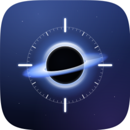
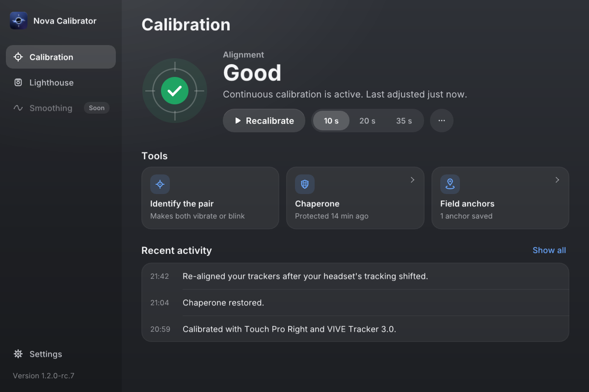
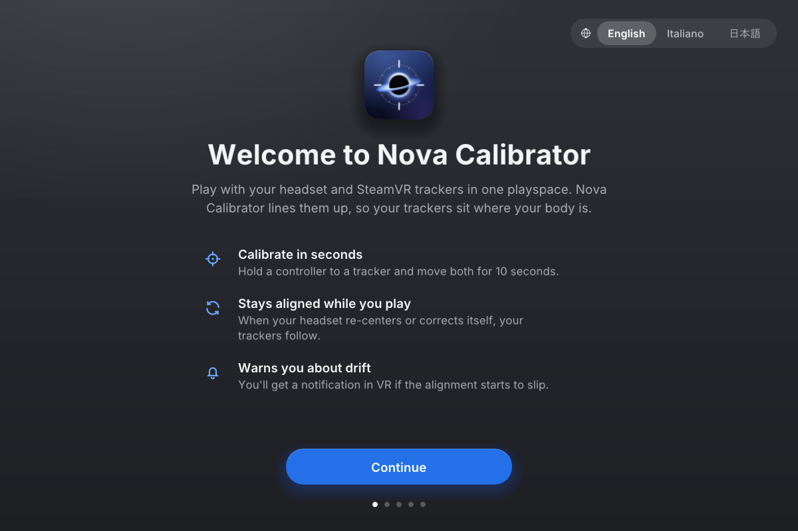
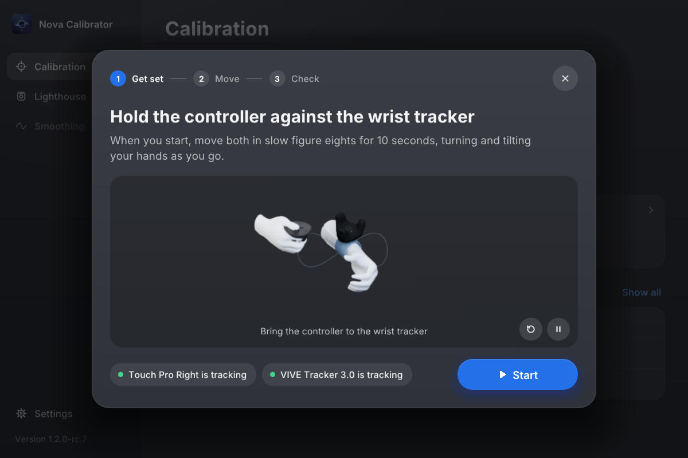
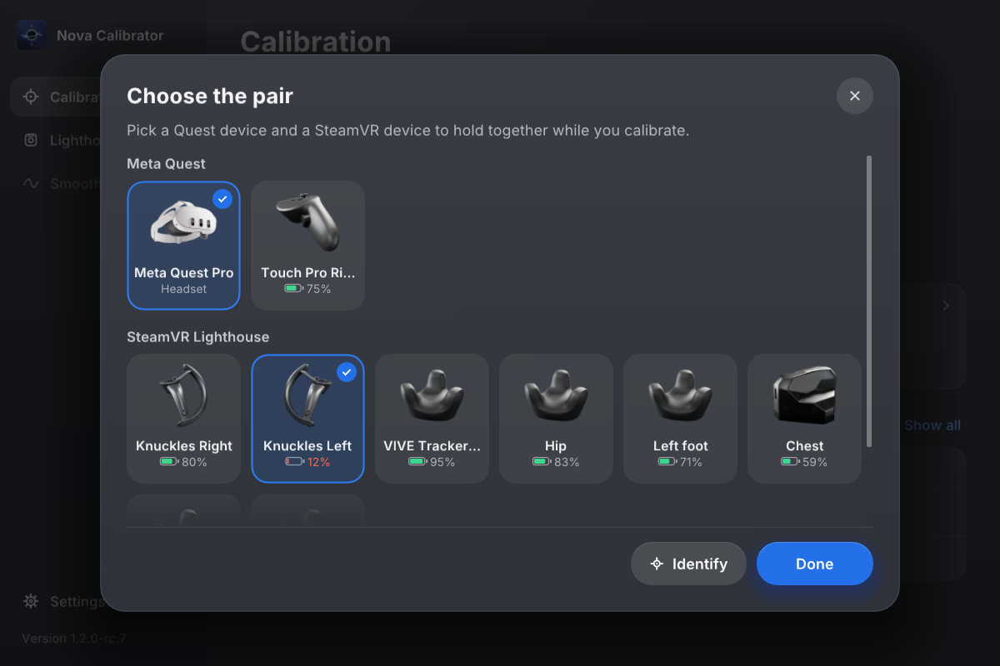
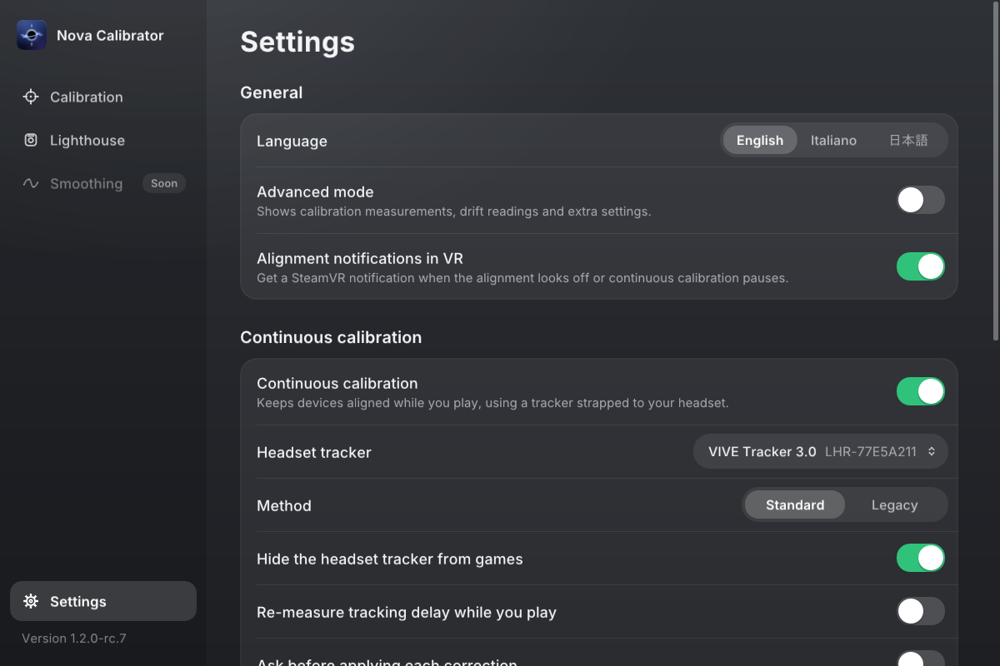
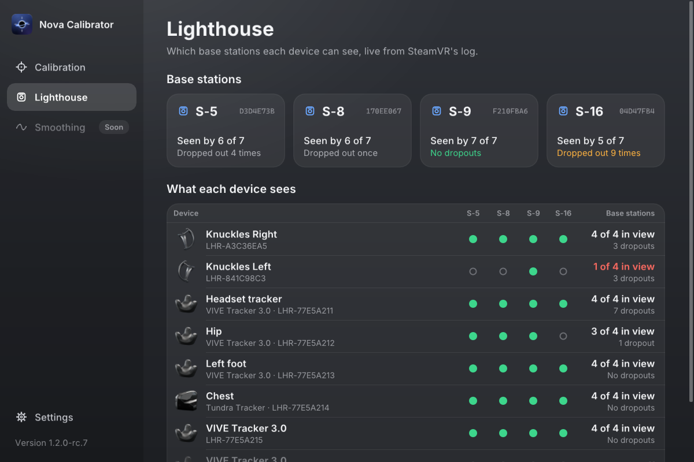

#  Nova Calibrator

[](https://github.com/VividNightmareUnleashed/NovaCalibrator/releases/latest)
[](https://github.com/VividNightmareUnleashed/NovaCalibrator/releases)
[](https://www.virustotal.com/gui/file/f57b4c231ab1507fb0f18724ab276c19e24a84898057e64ba9e215bc11f2c8e9)
[](https://store.steampowered.com/app/250820/SteamVR/)
[](https://github.com/ValveSoftware/openvr)

Play in SteamVR with a Meta Quest headset and lighthouse trackers or controllers at
the same time. Nova Calibrator lines the two tracking systems up into one
playspace, so your full-body trackers sit where your body is, and it can keep them
lined up while you play.

Nova Calibrator was called QuestCalibrator until 1.2.0. It started as a fork of
[OpenVR-SpaceCalibrator](https://github.com/pushrax/OpenVR-SpaceCalibrator) and has
since been largely rewritten, so calibrating is more accurate and harder to get wrong.



> **Before you install:** uninstall or disable OpenVR-SpaceCalibrator, and any fork
> of it. Both install a SteamVR driver that moves your devices, and two running at
> once will throw your tracking off.

## Install

1. Download `NovaCalibrator-<version>.zip` from the
   [latest release](https://github.com/VividNightmareUnleashed/NovaCalibrator/releases/latest).
   Ignore GitHub's **Source code** archives; they don't contain the program.
2. Close Steam completely, including from the system tray, not just SteamVR.
3. Extract the zip, right-click `Install.ps1` and choose **Run with PowerShell**.
   `README-INSTALL.txt` in the zip covers unblocking the files and a manual
   install.

Nova Calibrator then opens in the SteamVR dashboard every time SteamVR starts. If
QuestCalibrator is installed, the installer replaces it and keeps your calibration
and settings. It also asks whether you want the optional **Lighthouse** module, a
page that shows your base stations and which of them each device can see. Run the
installer again to add or remove it.

The first time it opens, Nova Calibrator walks you through your language, your
headset, the kinds of tracker you use, automatic updates and a first calibration.



Every release lists the SHA-256 of its zip and a VirusTotal report for each file in
it. Only download Nova Calibrator from this repository's releases.

## Calibrate

The **Calibration** page shows how well your trackers line up right now: **Good**,
**Usable** or **Bad**. Press **Calibrate**, or **Recalibrate**, and pick how long to
move: 10 seconds, or 20 or 35 if a short one doesn't come out well. A sheet shows how
to hold the two devices together and move them, counts down while you do, and tells
you the result.



To change which devices you calibrate with, open **…** next to the length and choose
**Choose the pair**: one Quest device and one SteamVR device. **Identify** makes the
two you picked vibrate or blink.



When it finishes, check in VR that your trackers line up. Nova Calibrator can send a
SteamVR notification when the alignment starts to look off, and **Recent activity**
on the same page says what it corrected and when.

If the alignment is right in one part of your room but off in another, open
**Field anchors**, stand in the bad spot and press **Add field anchor**. That spot
gets its own correction, blended in as you walk around.

## Keep it aligned while you play

Quest tracking shifts during a session: the headset re-centres, loses and finds its
map, or corrects its own drift. Nova Calibrator watches for these jumps and follows
them.

If you have a spare lighthouse tracker, you can also try **Continuous calibration**:
strap the tracker firmly to your headset, turn the option on in Settings and pick it
as the **Headset tracker**. Nova Calibrator then uses it to keep the two systems lined
up while you play. **Hide the headset tracker from games** keeps full-body setups
from mistaking it for a body tracker.

> Continuous calibration was shaped by testers' reports, since I can't test it on my
> own hardware. If something goes wrong with it,
> [open an issue](https://github.com/VividNightmareUnleashed/NovaCalibrator/issues)
> with the log files described below.



Continuous calibration has two methods:

- **Standard** pauses when the readings move away from the calibration, and resumes
  once they come back or hold steady. A tracker that briefly loses its base stations
  won't drag your body trackers with it.
- **Legacy** never pauses. Like OpenVR-SpaceCalibrator, it follows every change the
  headset tracker reports.

SteamVR switches a tracker off once it has sat still for a while (5 minutes unless
you changed it), and a tracker on your headset sits still whenever the headset is
off. If you take the headset off for longer than that, turn the tracker back on when
you put it back on; Nova Calibrator tells you when this happens. To stop it, set
**Turn off controllers after** to **Never** in SteamVR's **Startup / Shutdown**
settings.

Without a headset tracker, Nova Calibrator still corrects the jumps it can detect and
warns you when the alignment drifts.

## Base stations

With the Lighthouse module installed, the **Lighthouse** page lists your base
stations, which ones each device can see, and which drops out most often. It's the
quickest way to find a badly placed station.



## Other things it does

- **Protected chaperone:** saves your SteamVR walls and puts them back if SteamVR or
  the headset loses them.
- **Languages:** English, Italian and Japanese, picked on the first page or in
  Settings. The default is Windows' display language. The translations may not be
  perfect, so corrections are welcome as issues.
- **Updates:** off unless you turn them on, during the setup or in Settings. Nova
  Calibrator then checks this repository for a newer stable release, downloads only
  a package signed with the release key and matching the SHA-256 GitHub publishes
  for it, and installs only when you say so.
- **Advanced mode:** shows calibration measurements, drift readings and extra
  settings.

## Something wrong?

[Open an issue](https://github.com/VividNightmareUnleashed/NovaCalibrator/issues)
and attach both log files from `%LOCALAPPDATA%\NovaCalibrator\`: `NovaCalibrator.log`
and `NovaCalibrator.prev.log`. They record every calibration and correction, with the
numbers behind it. (QuestCalibrator's logs stay in `%LOCALAPPDATA%\QuestCalibrator\`.)

If the alignment goes wrong during play, turn on **Detailed calibration logging** in
Settings. Then press **Save diagnostics file** once while things look right, and again
after the problem shows up, before you recalibrate or restart. Say whether the problem
shows in SteamVR itself or only in the game, and which devices look out of place.
Diagnostics files leave out your name and folder paths.

## How it works

[docs/how-it-works.md](docs/how-it-works.md) has the detail: what changed from
OpenVR-SpaceCalibrator, how a calibration is worked out and checked, how alignment is
kept during play, and the math behind it.

## Building from source

You need the Visual Studio 2022 build tools (v143) and the Windows 10 SDK. Everything
else is in `lib/`, so there's nothing to restore.

```powershell
tools\validate-cpp.ps1 -Mode Build
```

This builds the solution into `x64\Release\` and runs the test harness
(`SolverTests.exe`, whose exit code is the number of failed scenarios). The
`VirtualQuest` submodule is private and not needed: without it the build leaves out
the simulated-headset tests and nothing else.

To run your build, copy `Driver\01novacalibrator` into SteamVR's `drivers` folder,
put `driver_01novacalibrator.dll` in its `bin\win64`, and start `NovaCalibrator.exe`
with `openvr_api.dll`, `manifest.vrmanifest` and `icon.png` beside it. Preview flags
such as `-uipreview` show any page without SteamVR.

More about the source:

- `tools\validate-cpp.ps1 -Mode Duplicates` scans for copied code, and
  `-Mode Analyze -All` rebuilds everything under Clang-Tidy. Settings live in
  `cpp-validation.json`.
- `tools\fuzz.ps1` runs the libFuzzer and AddressSanitizer targets for every untrusted
  input, defined in `Tests/Fuzz/FuzzTargets.h`.
- GitHub Actions builds and tests every push to `alpha` and `stable`, and every pull
  request into them, that changes more than documentation; it also fuzzes weekly and
  builds releases from tags ([docs/releasing.md](docs/releasing.md)).
- [docs/vendored-dependencies.md](docs/vendored-dependencies.md) lists everything in
  `lib/` and its license.
- `compile_flags.txt` is for clangd only; don't add machine-specific paths to it.

## License

Nova Calibrator is source-available: you can build and change it for your own use,
but redistributing it needs permission first and selling it isn't allowed. See
[LICENSE](LICENSE) for the exact terms.

The parts inherited from OpenVR-SpaceCalibrator, Copyright (c) 2020 Justin Li
(pushrax), stay under their original MIT License, included in `LICENSE`.
[THIRD-PARTY-NOTICES.txt](THIRD-PARTY-NOTICES.txt) has it with every other
third-party notice. Some calibration ideas (outlier rejection, axis-variance conditioning,
sampling raw driver poses) were inspired by the
[hyblocker fork](https://github.com/hyblocker/OpenVR-SpaceCalibrator) and written from
scratch; none of its code is included.

Nova Calibrator is not affiliated with Meta, Valve, HTC or VRChat.
